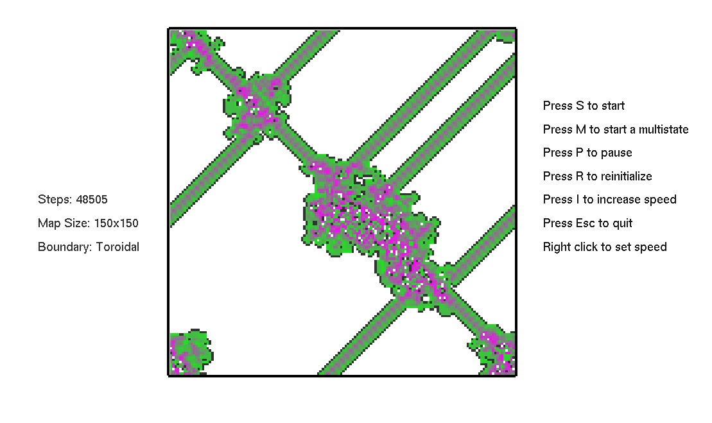

# Turmites





This program implements a Relative Turmite Turing machine on a rectangular map.

A collection of tables and rules:
https://code.google.com/p/ruletablerepository/wiki/TwoDimensionalTuringMachines

```
  Implemented functionalities:
 		Langton's ant
 			R and L turning directions
 			Multiple colours
 		Boundary conditions
 			Fixed
 			Toroidal
 		Multiple states
 			2state - 2colours
 
```

### User Inputs
 
There are three input files that you can modify.
 
##### 1) settings.txt
 
Here you can specify the width and height grid size on the first line and the boundary condition on the second line. A valu of 0 = fixed boundary, and 1 = toroidal
```
  Example:
  150 150
  1
```

##### 2) input_langton.txt

Enter the rotational rules for each colour with R for right turn and L for left turn. 
The Number of rotational rules set will also be the number of implemented colours
```
Example:
 		RL
  		LRLRLRLRLRLRLRL
 ```
##### 3) input_turmite.txt

Here you can specify the 12 digits corresponding to a 2-state 2-colour turmite. 
The machines are encoded  to the form {a, b, c} where a=new colour, b=movement, c=new state.
The movement is specified according to the literature:
  		1: no turn; 2: right; 4: u-turn; 8: left
 
``` 
Examples:
 
Fibonacci {1,8,1}, {1,8,1}, {1,2,1}, {0,1,0}. 
 	181181121010
Spiral: 
	111180121010
filled-triangle
	081121110111
box-spiral
	011081120011
striped-spiral
	021080181020
stepped-pyramid 
	021080181110
contoured-island
	021011121180
woven-placemat
	021021110021
snowflake
	021121181180
computer-art
        180121020081
ballon 
	180121021180
worm-trails
	121181121020
 ```

### To Run

A runable program can be found in the executable folder. This has only been tested under windows.

If you are using Visaul Studio you can open the turmite_v01.sln solution and hit F5, which should compile and run the project.

You can also build from the CMake file

:exclamation: Add all .dlls and input files to your executable folder.


----------------------------------------------------------------

        ?[-?_•?]?
  Author: Martin Lars Svante Johansson  
  email: martin.lars.svante.johansson@gmail.com 
 
